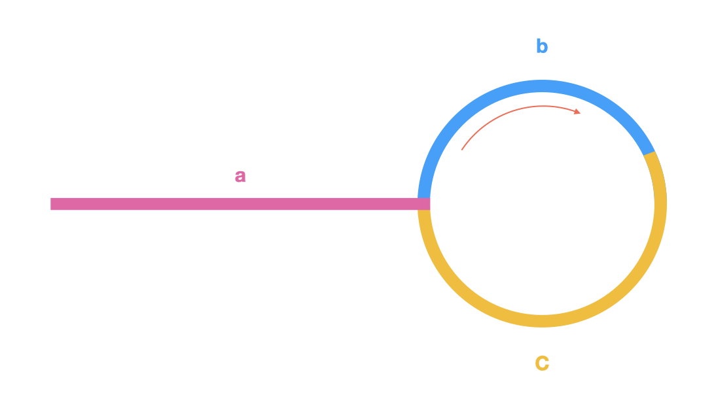

本题为 leetcode [第 142 题](https://leetcode.cn/problems/linked-list-cycle-ii/description/)。

# 题目描述

> 给定一个链表的头节点  head ，返回链表开始入环的第一个节点。 如果链表无环，则返回 null。
>
> 如果链表中有某个节点，可以通过连续跟踪 next 指针再次到达，则链表中存在环。 为了表示给定链表中的环，评测系统内部使用整数 pos 来表示链表尾连接到链表中的位置（索引从 0 开始）。如果 pos 是 -1，则在该链表中没有环。注意：pos 不作为参数进行传递，仅仅是为了标识链表的实际情况。
>
> 不允许修改 链表。
>
> 示例1 ：
>
> 
>
> <pre><strong>输入：</strong>head = [3,2,0,-4], pos = 1
> <strong>输出：</strong>返回索引为 1 的链表节点
> <strong>解释：</strong>链表中有一个环，其尾部连接到第二个节点。
> </pre>

# 思路分析

**核心问题：**

1. 如何判断有环
2. 如何找到环的入口

这道题用快慢指针来解决，慢指针每次移动一步，快指针每次移动两步。那么存在以下两种情况：

1. 不存在环，快指针先到达链表末端，返回null;
2. 存在环，快指针会先于慢指针进入环，并且快慢指针一定会在环内相遇。
   即当快指针等于慢指针时，说明存在环，第一个问题解决。

那么，如何找到环的入口呢？假设慢指针为 slow，快指针为 fast。
当快慢指针相遇时，假设链表头道环入口的距离为 a, 环入口到相遇点的距离为 b，相遇点到环入口剩余的距离为 c，如图所示：


因为快指针走过的总路程是慢指针的两倍，所以存在数学关系：`a + n*(b+c) + b = 2*(a+b)`。其中 n 是快指针绕环的次数。
化简可得：`a = c + (n-1)*(b+c)`。

通过这个公式可以推断出：从相遇点出发，再走 a 步可以到达环入口。

原因是：

1. `(n-1)*(b+c)` 表示 n - 1 圈，假设 slow 指针从相遇点出发，走了 n - 1 圈，最后停留的位置一定是相遇点；
2. 而从相遇点再往前走 c 步，就会到达环入口；
3. 已知：`a = c + (n-1)*(b+c)`，可以得出：从相遇点出发，再走 a 步可以到达环入口。

# 解题步骤

### 步骤一

**快慢指针**初始化：定义两个指针 slow 和 fast，初始时均指向头指针 head。

* 移动规则：

  * slow 指针每次移动一步。
  * fast 指针每次移动两步。
* 终止条件：

  * 如果 fast 和 fast.next 为 null，说明链表无环，返回 null。
  * 如果 slow 和 fast 相遇，说明链表有环。

### 步骤二

* 将一个指针 ptr 指向头节点，slow 指针依然指向相遇点
* 两个指针每次移动一步，再次相遇的节点就是环的入口

# 代码实现

```javascript
/**
 * Definition for singly-linked list.
 * function ListNode(val) {
 *     this.val = val;
 *     this.next = null;
 * }
 */

/**
 * @param {ListNode} head
 * @return {boolean}
 */
var hasCycle = function(head) {
    // 链表为空，直接返回 null
    if(head === null) return false

    let fast = head, slow = head

    while(fast) {
        if(fast.next && fast.next.next) {
            fast = fast.next.next
        } else {
            // 链表无环
            return null
        }

        slow = slow.next
        // 两个节点相遇
        if(fast === slow) {
            let ptr = head

            while(ptr !== slow) {
                slow = slow.next
                ptr = ptr.next
            }

            return ptr
        }   
    }
    return false
};
```

## 疑问解答

1. 假如存在环，为什么快指针（每次走两步）和慢指针（每次走一步）一定会相遇？
快指针的速度是慢指针的两倍，换句话说对于快指针来说，慢指针是静止的，快指针每次走一步。如果存在环，快指针一定会走过环的每一个节点，也就是一定会相遇。
2. 为什么存在环时快指针一定会在第一圈追上慢指针
**假设：**
* 环的长度为 L。
* 当慢指针进入环时，快指针已经在环内距离慢指针 k 步（0 ≤ k < L）。
还是从相对速度的角度来说，由于快指针与慢指针的相对速度为1步/次，快指针每走一步，与慢指针的距离级就缩短一步。因此，经过 k 步后，快慢指针相遇。
**关键点：**
无论 k 是多少（注意，0 ≤ k < L，k 一定小于 L），快指针最多需要 `L - 1` 追上慢指针（需要 L - 1 的场景是慢指针刚入环，快指针在慢指针的下一个节点）。

## 复杂度分析

|    **维度**    |                        **分析**                        |
| :------------: | :----------------------------------------------------: |
| **时间复杂度** |   O(n)，快慢指针最多遍历链表两次。   |
| **空间复杂度** | O(1)，仅适用常数级额外空间 |